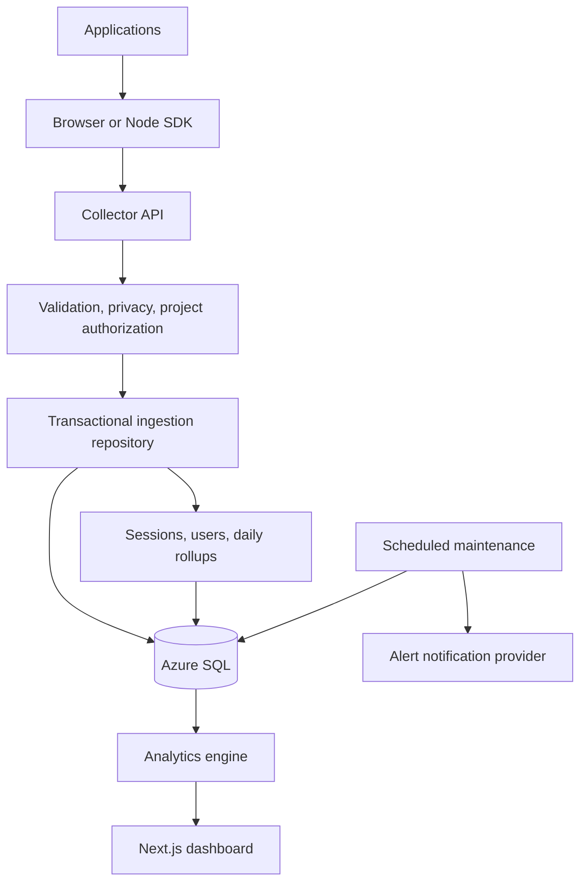

# Architecture and analytics definitions

## Storage

Production uses the `mssql` driver with a pooled, encrypted connection. Local development uses SQLite in WAL mode. Both implement the same `Connection` contract, execute parameterized queries, and share repository/analytics logic. Query helpers handle pagination and SQL date/JSON expression differences.

The initial schema includes projects, hashed scoped keys, raw events, sessions, anonymous users, daily user membership, daily rollups, deployments, feature definitions, funnels, saved views, alert rules/incidents, rate-limit buckets, settings, and audit logs. Time columns store canonical fixed-width UTC ISO timestamps (`YYYY-MM-DDTHH:mm:ss.sssZ`) for consistent ordering across both engines. Collector validation normalizes accepted timestamps before writing.

Indexes cover project/time, event/time, user/time, session/time, error fingerprints, rollup days, and deployments. The initial Azure migration is `migrations/001_initial.azure.sql`; migration application is transactional and recorded in `schema_migrations`.

## Ingestion

The collector validates a maximum of 100 events in a maximum 65,536-byte body. It accepts timestamps from the preceding seven days, with five minutes of future clock skew. Key lookup uses a SHA-256 hash and a restricted scope. Browser keys require an exact allowlisted Origin. Server keys require no Origin and must remain private. CORS reflects only a configured allowed origin, never `*`.

Each batch is ingested atomically. A project row lock serializes duplicate retries and projections for that project. Event UUIDs are idempotency keys. Sessions and anonymous users are scoped to the project. Out-of-order events update the first/last times and entry/exit routes correctly. Key creation, rotation, revocation, settings changes, and other administrative writes are audited.

Rollups are rebuilt for the affected project/day once per batch, so read-heavy dashboards do not rescan all historical raw events. For low-volume projects this trades simple, reliable ingestion for modest per-day aggregation work. For higher volume, replace the day rebuild with incremental counters or a background aggregation job, then add a queue behind the existing `ingest` service boundary if needed. Do not horizontally scale the local SQLite deployment; use Azure SQL.

The SDK's default batch target is 20 events and 55 KB, with a 200-event memory queue, timeouts, exponential retries, and `sendBeacon` on page exit. It does not persist an offline disk queue. Queued data can be lost when a tab crashes, an unload beacon fails, or the bounded queue overflows. Stable event IDs avoid duplicates when a request succeeds but its response is lost.

## Metric definitions

| Metric | Definition |
| --- | --- |
| Visitors | Distinct `(project_id, anonymous_id)` pairs active in the selected event-time window |
| Active now | Distinct anonymous visitors with events in the last five minutes of the selected endpoint |
| Sessions | Sessions whose first event falls within the selected window |
| Average session | Mean first-to-last event time for sessions beginning in range, clipped to the endpoint |
| Page views | Events named `page_view` |
| Conversions | Events named `conversion` or `signup` |
| Conversion rate | Conversion event count divided by sessions started; multiple conversion events in a session can exceed 100% |
| Error rate | Events named `error` divided by all events, not by requests |
| Traffic change | Unique-visitor change compared with the immediately preceding window of equal duration |
| Daily chart users | Daily active visitors, not an additive total of period-unique visitors |
| Feature adoption | Visitors who triggered a named feature event / project visitors |
| Repeat usage | Feature users with at least two occurrences in the selected period / feature users |
| Feature growth | Unique feature users vs. the immediately preceding period |
| Retention | First-ever anonymous-visitor cohorts; percentage active at each elapsed daily/weekly/30-day period |
| Error grouping | SHA-256 fingerprint of error name, message, and the first three stack lines |

Anonymous visitor IDs are intentionally scoped per project. The ecosystem visitor count is the sum of project-scoped people; it is not a deduplicated real-person count across products. `identify()` attaches an opaque ID but does not merge two devices or historical anonymous IDs.

Day rollups serve complete interior days. Partial boundary days are filtered against exact timestamps. Period comparisons have no overlap and the same millisecond duration. For a zero prior denominator, change displays +100% when the current value is nonzero and 0% when both are zero; interpret this as first observed activity, not a mathematically defined percentage increase.

## Specialized analytics

- **Funnels:** ordered events within the same session, a configurable maximum conversion window, one count per session per step, mean completed conversion time, and an equal-duration previous-period comparison. A funnel does not attribute across sessions.
- **Retention:** cohort age starts at a visitor's first-ever stored activity. Incomplete periods are hidden. The first period is acquisition and displays 100%. Monthly means 30 days. Retention is anonymous-device based. Feature repeat usage is available separately; arbitrary returning-event cohort configuration is not yet implemented.
- **Graveyard:** tracked features with at most three current visitors or at least 50% decline. Last-used timestamps include history up through the selected endpoint. This is a signal to investigate, not a recommendation to delete code automatically.
- **Rising Features:** tracked feature events with growing unique use. Automatic page/project growth ranking is not a separate screen; project traffic growth is in Overview and Compare Projects.
- **Performance:** interpolated P50/P75/P95/P99 over up to the latest 100,000 timing events. Breakdowns include project, route, version, browser, and device. CLS is unitless and omitted from combined timing summaries. Summaries cover all timing metrics; filter the table to inspect a specific metric. Do not interpret mixed timing summaries as one page's Web Vitals.
- **Releases:** equal windows of up to 24 hours around deployment time; recent releases use shorter matched windows. Measures traffic, error rate, average timing, session duration, and conversion events/session. This is observational, not causal.
- **Anomalies:** last complete UTC day compared with up to 14 prior days, at least seven baseline days, absolute z-score ≥2, and absolute count change ≥3. Starts with traffic, visitor, and error counts. No learned model or artificial health score.
- **Pulse:** template statements calculated from actual project query results; no LLM-generated observations.
- **Project map:** page views whose sanitized referrer hostname matches another registered project's domain. This is referral evidence, not cross-site identity stitching.
- **Event relationships/journeys:** consecutive non-telemetry events within a project/session, capped at the latest 50,000 matching events. Link width follows observed transitions. Next-action shares exclude session exits. Use Funnels for explicit drop-off measurement.
- **Historical Snapshot:** reconstructs event-time metrics within a chosen historical window. It is not a bitemporal audit of what the system knew at an earlier ingestion time. Backfilled events can change old snapshots. Administrative state such as current project enablement is not time-traveled.
- **Activity Heatmap:** daily ecosystem/project events, visitors, sessions, page views, errors, and conversions. Click a date to open its snapshot. Feature-specific history is available through Event Explorer, not a separate heatmap mode.
- **Saved views:** persist a fixed date range and reusable filters. They are not rolling relative-date reports.

Event lists have 100-row pagination. Session/user lists show the most recent 200 matches. CSV exports cover the displayed page (100 raw events), not an unbounded database export. Error groups and percentile views are intended for low-volume personal applications; consider additional materialized aggregates as volume grows.

## Maintenance and notification lifecycle

Run `npm run db:maintain` or authenticated `POST /api/maintenance` every five minutes. It applies a configured UTC-day retention boundary, removes expired rate buckets, evaluates alert rules, persists incidents, and delivers pending incidents through an optional `NotificationProvider`.

Rules support error-rate thresholds, P95 timing thresholds, collector silence, traffic drop, and conversion-rate drop. Most use a one-hour window; drops compare the preceding hour. An incident is created at most once per rule per hour. Webhook requests include an incident idempotency key. A successful delivery marks the incident as notified; failed deliveries remain pending for the next run. Without a provider, incidents stay visible in the dashboard. Retention cleanup does not delete audit logs, deployment metadata, feature definitions, or alert history.

## Authentication

This is a single-owner administrative workspace. Production reads require an admin bearer key or an expiring HMAC-signed HttpOnly session cookie. Session cookies use SameSite=Strict and Secure when PUBLIC_URL is HTTPS. Cookie-authenticated mutations also require the exact configured Origin. Login is limited to ten attempts per minute across the deployment. Missing/short production secrets fail closed. Rotate ADMIN_KEY and SESSION_SECRET together to invalidate both API credentials and existing login sessions.

Origin restrictions help prevent accidental browser misuse; a public browser key is not a secret, and Origin headers can be fabricated by non-browser clients. Never use browser analytics events as proof of a financial/security action. If stronger data provenance becomes necessary, ingest important events with server keys and trusted server code.

## Login Geography

[Event Geography](geography.md) enriches every event type and extends existing events with nullable login/geographic metadata. Short-lived encrypted work inputs are enriched after the collector response through provider adapters; the database-backed worker also runs during maintenance. SQL aggregates, project-scoped unique counts, bounded map points, and explicit event-field projections preserve the existing single-owner authorization and privacy boundaries.
